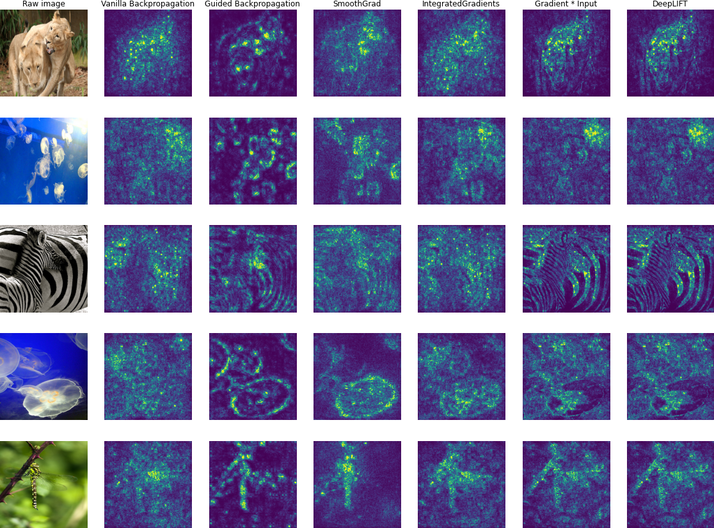

# Saliency Maps
PyTorch implementation of some saliency map methods for XAI.

**It can be used for any PyTorch pretrained models and show the saliency map of any layer.**

Please follow the tutorial in the notebook ```show_saliency_maps.ipynb```.




## update
```v0``` is the old version. The new version can be used for any PyTorch pretrained models and show the saliency map of any layer (e.g., for ```VGG19```, you set the hook layer(s) ```[features.20]``` or ```[features.10, features.20, features.30]```).